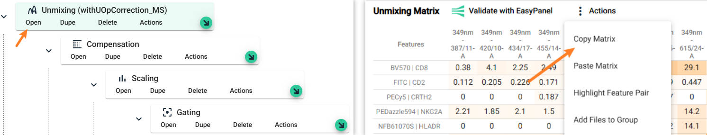

# Unmixing Matrix Optimizer (UMO)

Xiangming Cai   
2025 April 1

Welcome to the Unmixing Matrix Optimizer, your go-to tool for correcting the unmixing matrix in flow cytometry analysis. This guide will help you understand how to use the tool.

Visit the project in [Github](https://github.com/xiangmingcai/UnmixingMtxOptimizer.github.io).

## Application scenario
In general, there are four types of fcs file: **1. single-color control beads; 2. single-color control cells; 3. multi-color samples; 4. negative control.**

The UMO can be used to address unmixing issues, as shown below, in both single-color cells and multi-color samples.

  

### 1. if you have single-color control cells

In this scenario, the unmixing matrix is probably extracted from single-color control beads. Also, the single-color control cells and multi-color samples are prepared together. That means you assume corrected unmixed results for multi-color samples, if the single-color control cells could be correctly unmixed.

However, sadly, you find unmixing error, as shown above for on single-color control cells.

In this case, UMO should perfactly address the issue by correct unmixing matrix with your single-color control cells.

### 2. if you have no single-color control cells

In this scenario, the unmixing matrix is extracted from single-color control beads. You have no single-color control cells. Or there are important change of experimental condition that makes the single-color control cells very different from your multi-color samples.

When you apply the unmixing on your multi-color samples, you saw this heartbroken unmixing issue.

This issue is challenging to resolve because multiple fluors may contribute to it.

However, in practice, the UMO can still optimize the unmixing results, with small impact on other unmixed channels. So, give it a try! Just remember to check other channels afterward.

## Requirements

**Operating System**: No requirment for Operating System. 

**Browser**: The UMO was tested with Microsoft Edge. So, probably Chrome also works. However, Firefox is not supported.

**Hardware**:
It depends on the fcs files that you are using. In general, a 8 GB RAM or higher is recommended.

Internet connection is needed.

## Installation 

No installation is needed. You could simply open the **[Unmixing Matrix Optimizer (UMO)](https://xiangmingcai.github.io/UnmixingMtxOptimizer.github.io/)** website and use it.

## File preparation
### 1. Unmixing matrix file
The unmixing matrix file contains the extracted signatures of fluors (and autofluorescence (AF)) in your experiment. 

In general, most spectrum cytometer instrument have embadded unmixing process, and users need to select single-color control populations for each fluor and AF. During these steps users are extracting signatures for each fluor and AF. These extracted signatures will be put together to be an unmixing matrix.

However, these instrument may not allow users to export the extracted unmixing matrix. To obtain your unmixing matrix, users could export the raw single-color control fcs files, which include signals at each channel/detector. Then, users may use FCS Express, OMIQ or other flow analysis program to select populaitons and extract unmixing matrix. The unmixing matrix could be used to do unmixing for your multi-color samples in most flow analysis program, including FCS Express and OMIQ. 

**To help you easily prepare your own unmixing matrix, we also delevoped an out-of-the-box webtool, [Unmixing Matrix Generater (UMG)](https://github.com/xiangmingcai/UmixingMtxGenerator.github.io). If you have all the single-color control fcs files ready, you should be able to use UMG to extract the unmixing matrix in 30 mins ~ 1h.**

  

The unmixing matrix should be saved as a **csv** file.

The format is exactly the same as the format from [OMIQ](https://www.omiq.ai/), if you copy matrix in Unmixing module. However, if you do not use OMIQ, it is also easy to prepare the file in excel and save as csv file

  

The first two columns are for the names of fluors. The rest columns are for signal intensity in each channel. 

The column names of first two columns **must** exactly be "Primary" and "Secondary". It is case sensitive and contains no spaces.

The column names of the rest columns must match the channel names stored in your fcs file. You should be able to export it in any flow analysis program.

I personaly do not use any spaces or symbol, except underscore, when naming fluors. However, if you have it in the fluor names, it is probably fine. If not, please let me know.

For the use of the webtool, it does not matter whether the signals are normalized or not.

### 2. fcs file

Raw fcs files exported from Aurora, Xenith, Fortessa, and CytPix are tested and supported by UMO and UMG.

We are also testing other flow cytometers and will update when we have results.

Ideally, the UMO should be able to handle the fcs file that you aquired directly from your flow cytometer. The fcs file should contain the raw data for each channel (detecter). Unmixed results, if any, should **not** be included in the fcs file.

## Usage Steps

### 1. set up

First, press the button to select a data folder, where your fcs files are stored. The UMO will search the folder to generate a file list below.

Second, select the unmixing matrix **csv** file, and click the "Read the UnmixMatrix CSV" button to check the imported matrix. You may scroll the table to confirm all rows are corrected and no empty rows or columns or anything weird.

  

Now, you will see more options shown below. You need to set the "positive signature". For single-color cells control, it means the fluor used. 

For multi-color sample, it means the positive axis of population with unmixing issue. For example, in the following figure, the population with unmixing issue was circled. We expect this population to be CD4+ and CD16-. So, we want to pull it towords the middle. Here, CD4 is the "positive signature".

  

  

Then, you need to select a fcs file. It could be a single-color control cells file or multi-color sample file, depending on your scenario.

Note: you need to switch the selected file once to see the following options.

Before import the fcs file, we need to think about subseting cells. Because the UMO only needs **dozens** of representative cells, you do not need to import millions of cells with the risk of crushing the browser. 

Here we offer two options, "Random Subset" and "Max Subset". "Random Subset" is simple sampling. The "Max Subset" will first identify the peak channel of positive signature based on the unmixing matrix, and choose the top cells with high signal on the peak channel.

You also need to set the sample size. This number greatly impact the running speed of UMO. We recommend 50000 for the first try. You may repeat with different sample size afterward. 

If the size of the fcs file is too big, and you keep getting crushed, you may consider export a smaller fcs file with other flow cytometry analysis program, like Flowjo, OMIQ, or FCS Express.

Now, you may click "Read fcs file" button, and wait for 5~30 seconds. UMO will tell you when it is done and show some details.

  

### 2. select populations

Click the "Select populations" button, and you will see the following options.

  

We do not need to use all imported cells for plot, so, here you could set a number for plotting.

You need to select x and y axes for the scatter plot. Generate plot when you are ready.

  

The purpose of this step is to select "positive populaiton" and "negative population". The "positive population" is a cluster of cells that **shifted the most** (most representative). 

The "negative population" is a little bit more complex. For singel-color control cells, it could be any of these **less shifted** cells, so, it is ok to select probably any population from the one close to "positive population" to the one that is exactly negative at both axes. 

For multi-color samples, a cluster of cells on the scatter plot could be highly complex and heterogeneity, because some could be positive for other fluors while the rest being negative. We want to make sure that the selected "positive population" and "negative population" only differ in these two plotted axes. We want these two populations are homogeneous in other axes. So, the "negative population" needs to be very very very close to the "positive population". As close as possible. 

Here is example for singel-color control cells:

  

Here is example for multi-color samples:

  

The interactive scatter plot is made with [plotly.js](https://plotly.com/javascript/). Both axes are log10 scaled. When your mouse hover over the plot, you will find some buttons on the right upper corner. You may use them to zoom in, zoom out, move, or download the plot as png. 

There is also a box selection and a lasso selection botton. You could use them to select population and click the "Set selected cells as shifted posotive population" button or "Set selected cells as negative population" to confirm your selection.

  

It is also possible to do subpopulation before selecting the "positive population" and the "negative population".
To do one subpopulation operation, you need to follow 3 steps:

1. Select cells;
2. Select new axes;
3. click "Re-plot with selected cells" button.

  

  

  

Sometimes you might accidently click re-plot button without select new axes. No worries, you could continue by selecting all cells and make new subpopulation plot.

Also, it is always ok to click "Create Scatter plot" button to restart selection.

### 3. correct unmixing matrix

Finally, here you are! You may click the "Correct when you are ready!" button to see more options now.

The UMO will calculate the difference between the "positive population" and the "negative population" and generate a "leftover signature" from the difference. The "leftover signature" will be used to correct the raw positive signature (CD4 in our case).

Corrected_signature = Raw_signature + (Correct_factor * Leftover signature)

  

UMO will put a recommend Correct Factor in the input box. You may simply use it first and click "Submit" button to check the results. You can change the Correct Factor afterward if you are not satisfied with the results.

  

Still, you could set the axes or do subpopulation like what you did in step 2.
You will find the corrected results in the plot now. If you are not happy with the results, you may 

1. Change the Correct Factor;
2. Click "Submit" button;
3. Click "Create Corrected Scatter plot".

to generate the new results. 

If you scroll down, you will find the line plot, which present the spectrum or raw positive signature and corrected positive signature. 

  

This line plot provides a clear visualization of the extent of changes made by the UMO.

### 4. save results

  

With these two button, you could save the corrected unmixing matrix with exactly the same format. That helps if you want to correct another unmixing issue afterward.

You can also save the log for your experiment records. **Please note that UMO is a static website, meaning everything you do with UMO is 100% local.** No data is sent out, and we do not store any user information. Therefore, if you want to save your process or results, you will need to do so manually.

## Citation and Support

If you find this tool helpful, please consider citing our work in your research. For more information, visit the GitHub project page.

If you encounter any issues, feel free to report in the [github repository](https://github.com/xiangmingcai/UnmixingMtxOptimizer.github.io/issues). 

Thank you for your support! 😊
